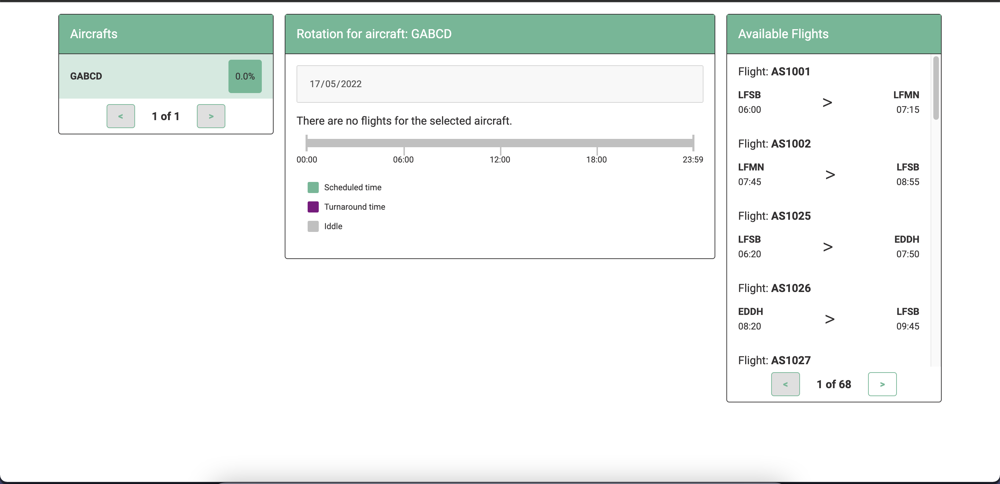

# Aircraft Scheduling



## Content

All topics in this readme:

<details>
  <summary>Table of Contents</summary>
  <ol>
    <li>
      <a href="#sobre-o-projeto">About the project</a>
      <ul>
        <li><a href="#technologies">Technologies:</a></li>
        <li><a href="#status">Status:</a></li>
        <li><a href="#structure">Project Structure:</a></li>
      </ul>
    </li>
    <li>
      <a href="#start">Getting Start</a>
      <ul>
        <li><a href="#instalação">Installation:</a></li>
        <li><a href="#configuration">Configuration:</a></li>
        <li><a href="#starting">Running:</a></li>
      </ul>
    </li>
  </ol>
</details>

<!-- ABOUT THE PROJECT -->

## About the project

This is an aircraft scheduling project to optimize utilization for aircrafts of a fake aircraft company.

<p align="right">(<a href="#aircraft-scheduling">Back to top</a>)</p>

### Tecnologies

This project was created with create-react-app; Below are all the technologies/tools involved:

- [React.js](https://reactjs.org/)
- [Storybook](https://storybook.js.org/)
- [Sass](https://github.com/sass/node-sass)
- [React Testing Library](https://testing-library.com/docs/react-testing-library/intro/)
- [Cypress](https://github.com/cypress-io/cypress)
- [prop-types](https://reactjs.org/docs/typechecking-with-proptypes.html)

<p align="right">(<a href="#aircraft-scheduling">Back to top</a>)</p>

### Status

The project feature status currently is:

- [x] Get aircrafts and flights from the API
- [x] Select aircrafts to create rotation
- [x] Add and Remove flights to create rotation(following the rules) and check aircraft utilization
- [x] Timeline
- [x] User can only create rotation for the next day
- [ ] Save the current rotation
- [ ] Mobile: Mobile should have a specific behavior, even if it's currently working, this project did not focus on-grid and this stuff, only to create a basic page structure on desktop.

<p align="right">(<a href="#aircraft-scheduling">Back to top</a>)</p>

### Project Structure

The initial project structure was created with create-react-app, cleaning all non used files. The current structure is:

- src/components

  Where all the components of the application are. All components have MD files containing a basic explanation of what the components are. Example: Flights, Flights List, Aircraft, Scheduler, Pagination etc..

- src/config

  Configuration files for endpoints, messages and other config variables.

- src/hooks

  Custom hooks were created to consume and handle logical stuff with the flight/aircraft/rotation data in order to facilitate the development.

- src/**mocks**

  Mock data to storybook and test utilization

- src/utils

  Utility files with functions to facilitate the development

- src/styles

  All styles here are common to the application. But components specific styles are on their respective paths.
  Exemplo: Variables, global, grid, etc

- cypress/integration

  All integration tests where located in cypress/integration

<p align="right">(<a href="#aircraft-scheduling">Back to top</a>)</p>

## Getting Started

### Install

Installing the project:

```sh
yarn install
```

### Configuration

1. Open .env from the root path
2. Add the API_HOST for the api requests
   ```sh
   REACT_APP_API_HOST=http://api.url/
   ```
   <p align="right">(<a href="#aircraft-scheduling">Back to top</a>)</p>

### Running

Running the project:

```sh
yarn start
```

Running cypress integrationtests:

```sh
yarn cypress:open
```

Running unit tests:

```sh
yarn test
```

Running storybook:

```sh
yarn storybook
```

Build:

```sh
yarn build
```

<p align="right">(<a href="#aircraft-scheduling">Back to top</a>)</p>
